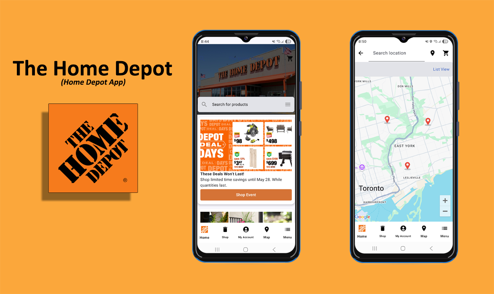
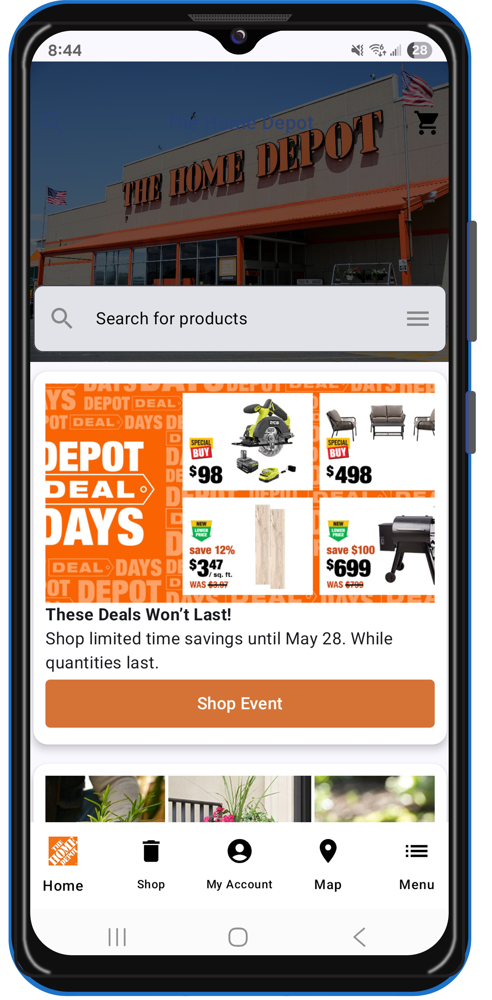
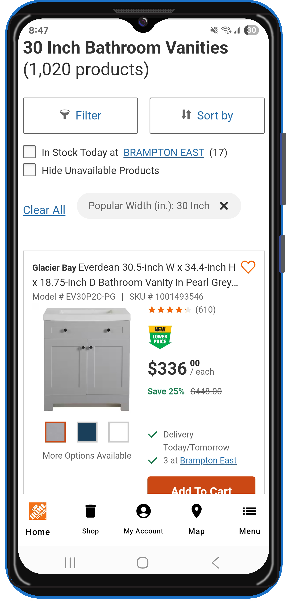
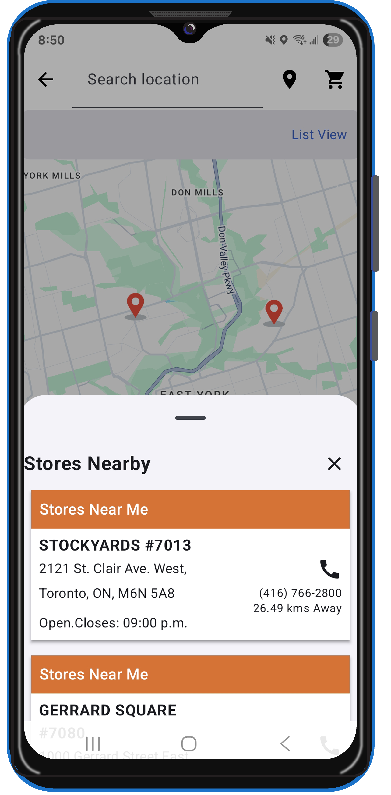
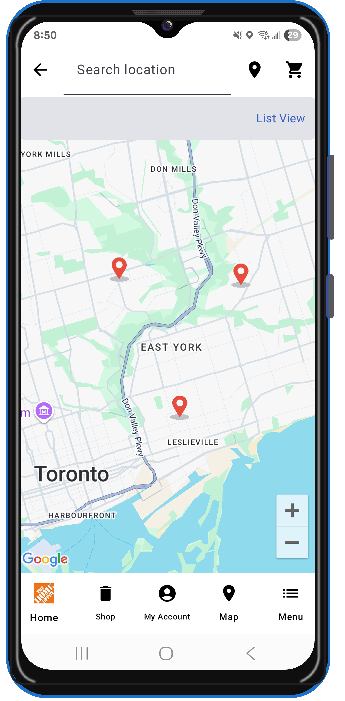
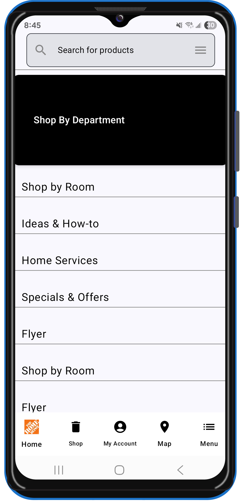
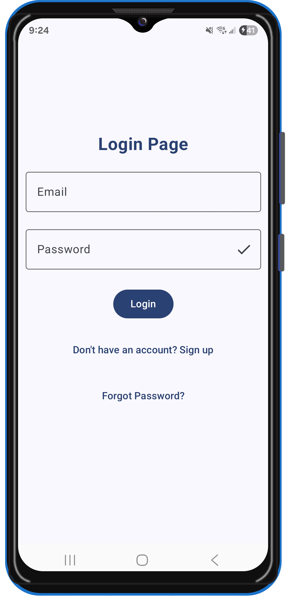
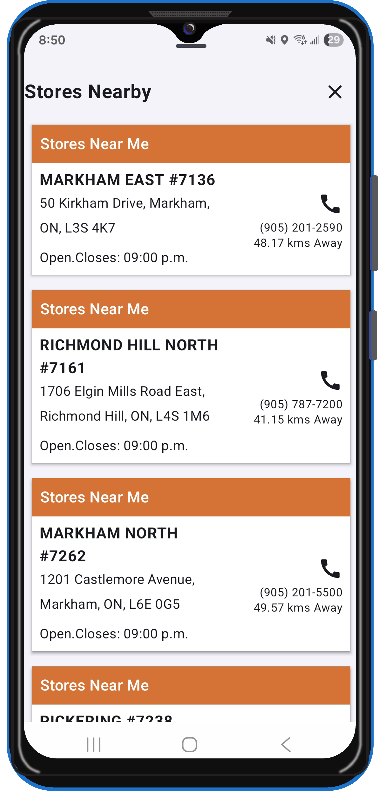
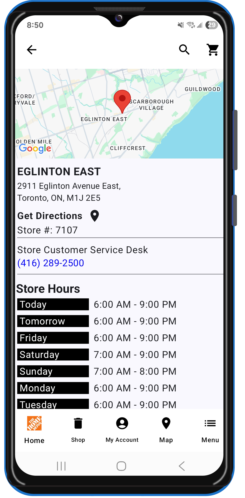

<div style="text-align: center;">
    <h1>The Home Depot – Jetpack Compose</h1>
</div>

<div align="center">
    
    <p><em>Your go-to home-improvement companion built with Jetpack Compose</em></p>
    <!-- Optional: Uncomment and update the link when live on Play Store -->
    <!-- <a href="https://play.google.com/store/apps/details?id=com.yourcompany.homedepot">
        
    </a> -->
</div>

---

## 📖 Overview

The Home Depot app is a portfolio demo showcasing an intuitive browsing and purchasing experience for home-improvement products. Powered by modern Android tools and Jetpack Compose, it features product catalog exploration, secure authentication, personalized wishlists, and real-time store discovery.

**Key Selling Points:**

* **Product Browsing:** Scroll and search thousands of items with high-performance image loading via Coil.
* **Secure Authentication:** Sign in using Firebase Auth, Google Sign-In, Credentials API, or Biometric prompts.
* **Favorites & Sync:** Save wishlist items to Firestore and access offline via DataStore.
* **Store Locator:** Find nearby Home Depot locations on a Compose map with distance calculations.
* **Smooth UI Patterns:** Swipe-to-refresh, shimmer placeholders, and animated transitions for seamless UX.
* **Checkout Flow:** Add to cart and simulate checkout with secure form handling and WebView integration.

---

## 🎨 App Showcase

Below are placeholder images demonstrating The Home Depot’s core screens. Replace with actual screenshots in `/screenshots/`.

| Home Screen                                                               | Product Details                                                                  | Favorites & Cart                                                                  | Store Locator & Map                                                           |
| ------------------------------------------------------------------------- | -------------------------------------------------------------------------------- | --------------------------------------------------------------------------------- | ----------------------------------------------------------------------------- |
|  |  |  |  |

| Checkout Screen                                                                   | Authentication                                                                  | Settings & Profile                                                                    | Search Results                                                                  |
| --------------------------------------------------------------------------------- | ------------------------------------------------------------------------------- | ------------------------------------------------------------------------------------- | ------------------------------------------------------------------------------- |
|  |  |  |  |

**Screen Descriptions:**

* **Home Screen:** Browse featured categories, see top deals, and search in-app with realtime suggestions.
* **Product Details:** View high-res images, specs, and customer reviews; add to wishlist or cart.
* **Map Screen:** Displays all nearby Home Depot store locations on a Google Map using Maps Compose. Each marker is interactive, showing store name, distance, and quick access to details.
* **Store Locator & Map:** Display nearby stores with marker icons and calculate distance using Play Services Location.
* **Search Screen:** Enables users to search for Home Depot stores or specific products.
* **Authentication:** Multi-method sign-in including Firebase, Google, Credentials API, and Biometric.
* **Store List:** A vertically scrollable list of Home Depot stores based on proximity..
* **Store Details:** Provides detailed information about a selected store including its address, contact number, working hours, directions via Google Maps intent, and available services.

---

## 🛠️ Tech & Architecture

* **Language:** Kotlin
* **UI Toolkit:** Jetpack Compose
* **Architecture Pattern:** MVVM + Clean Architecture
* **Dependency Injection:** Hilt
* **Networking:** Retrofit + Moshi + OkHttp
* **Image Loading:** Coil Compose
* **Authentication:** Firebase Auth, Credentials API, Google Sign-In, Biometric API
* **Data Storage:** Firestore (remote), DataStore Preferences (local)
* **Maps & Location:** Maps Compose, Play Services Maps & Location
* **UI Libraries:** Accompanist (SwipeRefresh, Placeholder, System UI Controller)
* **Concurrency:** Kotlin Coroutines & Flow
* **Web Content:** AndroidX WebView
* **Testing:** JUnit, Espresso
* **CI/CD:** GitHub Actions (optional)

**Module Structure:**

```
|-- app              # Main Android application module
|-- core             # Shared utilities, models, and network clients
|-- data             # Remote and local data sources, repositories
|-- domain           # Business logic and use-cases
|-- presentation     # Compose UI screens and ViewModels
```

---

## 🌐 Portfolio Showcase

This repository is a portfolio demonstration of advanced Android capabilities with Jetpack Compose, clean architecture, and robust feature integrations—ideal for showcasing to potential employers or collaborators.

---

## 📂 What’s Included

This repo contains:

* **📸 High-Res Screenshots**
  Key screens captured with annotations in `/screenshots/`.
* **📝 Documentation**
  Wireframes, user flows, and architecture diagrams in `/docs/`.
<!--* **📱 APK Download**
  A debug APK (`app-debug.apk`) for hands-on testing.
* **🎥 Demo GIF**
  Short walkthrough highlighting core interactions in `/demo/`.-->

> **Note:** Full source includes proprietary logic; this repo is tailored to showcase UI/UX architecture and feature demos without exposing sensitive components.

## 📝 License

MIT © Akmal Hameed

---

*The Home Depot – Empowering home improvement, one Compose layout at a time.*
